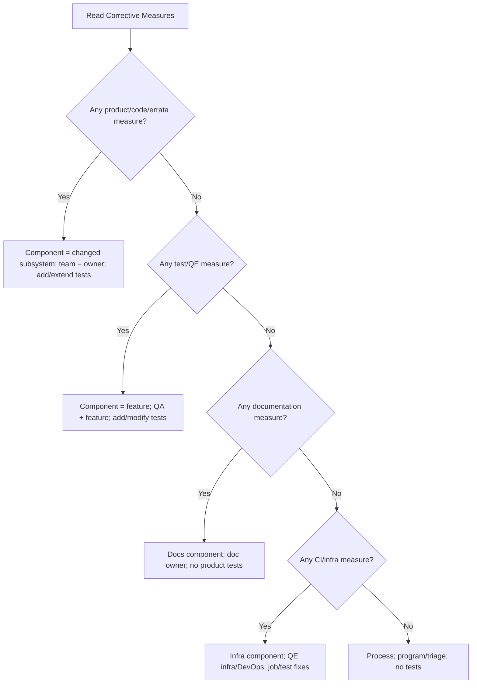

# EcoSystem Engineering Close Loop — Review queue report

**Generated:** 2026-04-03  
**Purpose:** Single reference for the **Review** backlog: JQL source, **Corrective Measures**–driven routing (component, team, tests), per-issue table (**Corrective Measures** × **Jira Component** × **OCP/RHEL**), and a CSV template for pasting measures from Jira.

---

## 1. Jira source

**Saved filter (UI):** [Filter 87438](https://redhat.atlassian.net/issues/?filter=87438)

**JQL used for the snapshot below:**

```jql
project = "EcoSystem Engineering Close Loop"
  AND type = "Closed Loop"
  AND (
    resolution IN (Unresolved, Done, Done-Errata, "Test Pending")
    OR resolution NOT IN ("Not a Bug", Duplicate)
  )
  AND created <= startOfDay()
  AND status = Review
ORDER BY created DESC
```

**Snapshot:** 42 issues returned (API query). Resolutions in that pull were all **Unresolved** (`null` in REST).

---

## 2. Corrective Measures (Jira field)

| Item | Detail |
|------|--------|
| **Display name** | Corrective Measures |
| **Field ID** | `customfield_10994` |
| **Type** | Red Hat multi-select (`rh-cf-multi-select`) |
| **API note** | Values may appear as **opaque strings** over REST; use the **Jira UI** as the source of truth for selected labels. |

### 2.1 How to use Corrective Measures in review

1. **Read** all selected options on the Closed Loop issue.
2. **Primary closure path:** if any selection implies a **product/code/errata** fix, treat that as primary for component ownership; otherwise use precedence: **test/QE** → **infra/CI** → **documentation** → **process**.
3. **During Review:** update selections if the agreed closure type changes.
4. **Before Done / Done-Errata:** selections must match what was actually executed.

### 2.2 Routing (each selected measure)

| If Corrective Measures includes (match your UI labels) | Component focus | Owning team | Tests |
|--------------------------------------------------------|-----------------|-------------|--------|
| Product / code / errata / upstream fix | Subsystem being changed | Component engineering owner | Add or extend regression in that area |
| Test / automation / QE coverage | Feature under test | QA + feature review | Add or modify automated cases |
| Documentation / KB | Docs / product docs | Documentation or feature doc owner | Usually none |
| CI / lab / tooling | Pipeline / test infra | QE infra / DevOps | Stabilize jobs or add infra smoke |
| Process / training / governance (no engineering change) | N/A or process | Program / triage | None |

---

## 3. Decision flow (overview)



---

## 4. Snapshot — component distribution (42 issues)

| Component | Count |
|-----------|------:|
| Telco | 14 |
| kernel / Networking / NIC Drivers | 7 |
| ACM | 6 |
| *(none)* | 7 |
| Networking / multus | 2 |
| kernel / File Systems / CephFS | 1 |
| odf--4.18 | 1 |
| oauth-apiserver | 1 |
| Installer / Assisted installer | 1 |
| LCA operator | 1 |
| Telco Edge / ZTP | 1 |
| Node / CRI-O | 1 |
| Node / Numa aware Scheduling | 1 |
| qemu-kvm / Live Migration | 1 |
| ECOENGCL-340 multi: CephFS, filesystems,, kernel / Networking | 1 |

---

## 5. Per-issue table: Partner / Customer × Corrective Measures × Jira Component × OCP/RHEL

**Partner / Customer:** Use your Jira field for account or customer name if you have one. Set **`JIRA_PARTNER_CUSTOM_FIELD`** (e.g. `customfield_12345`) in `.env` and run `scripts/fill_review_queue_corrective_measures.py` to populate the CSV from the API; otherwise paste from the issue or leave blank.

**Corrective Measures** (`customfield_10994`, multi-select): the REST API returns **encrypted** values for this field, so **human-readable labels must come from the Jira issue screen** (or from a Jira **Export** that includes the column, if your export shows them). In the table below, the **Corrective Measures** column is **intentionally blank**—paste the selected options from each issue, or edit the companion CSV.

**OCP / RHEL category:** High-level bucket for reporting (from summary + Jira components). Use **OCP** for OpenShift/platform/cluster workflows, **RHEL** for RHEL/kernel/userspace errata–style items, **OCP + RHEL** when both are in play (none forced in this snapshot). Override manually when wrong.

**Spreadsheet:** `reports/review-queue-corrective-component-ocp-rhel.csv` — same rows; columns `partner_or_customer` and `corrective_measures_paste_from_jira` are empty unless filled from Jira or the fill script.

| Key | Partner / Customer *(paste or API)* | Corrective Measures *(paste from Jira)* | Jira Component | OCP / RHEL | Summary |
|-----|-------------------------------------|----------------------------------------|----------------|------------|---------|
| ECOENGCL-452 | | | kernel / Networking / NIC Drivers | RHEL | MR rhel-9/-/merge_requests/5470 introduces a breaking API change |
| ECOENGCL-451 | | | — | OCP | BMO cannot abort inspection when deletion is requested |
| ECOENGCL-450 | | | Installer / Assisted installer | OCP | In SNO clusters MCC cannot take the lease after the node is rebooted |
| ECOENGCL-449 | | | oauth-apiserver | OCP | apiserver-library-go shall be updated to include more safed sysctl to reflect upstream changes |
| ECOENGCL-448 | | | kernel / Networking / NIC Drivers | RHEL | Embedded NIC interface name inconsistent on HPE DL110 gen12 (GNR-D) after BIOS upgrade [rhel-9.7.z] |
| ECOENGCL-447 | | | odf--4.18 | OCP | ODF installation constantly fails with Assisted Installer |
| ECOENGCL-446 | | | Telco | OCP | [CLOSED LOOP for] [release-4.11] [AWS EFS] NFS mount disconnects and becomes unavailable. |
| ECOENGCL-443 | | | ACM | OCP | ACM 2.15.0: Worker node scale-in fails: BareMetalHost stuck in deleting due to Ironic cleaning error: missing uefi_esp.img |
| ECOENGCL-442 | | | — | OCP | Not able to trigger AlertmanagerFailedToSendAlerts with webhook-configuration |
| ECOENGCL-441 | | | LCA operator | OCP | openshift-lifecycle-agent ServiceMonitor triggers PrometheusOperatorRejectedResources alert |
| ECOENGCL-440 | | | Telco Edge / ZTP | OCP | Disabling chrony according to RDS leads to problems with chrony-wait.service |
| ECOENGCL-437 | | | Telco | OCP | [CLOSED LOOP for] [Verizon] Apparent race condition between ovs-configuration and bonding |
| ECOENGCL-436 | | | Telco | OCP | [CLOSED LOOP for] [ACM] ACM cannot access ironic-python-agent on dual-stack environment but only IPv6 is unreachable |
| ECOENGCL-435 | | | ACM | OCP | BareMetalHost deletion stuck due to Foreground deletion policy deadlock with PreprovisioningImage |
| ECOENGCL-434 | | | — | OCP | whereabouts-token-watcher does not renew the kubeconfig token |
| ECOENGCL-433 | | | Telco | OCP | [CLOSED LOOP for] Egress IP assigned to a secondary interface is also being incorrectly applied to the br-ex bridge |
| ECOENGCL-432 | | | Telco | OCP | [CLOSED LOOP for] Whereabouts: Duplicate IPs allocated in OCP 4.16 (similar to OCPBUGS-58405) |
| ECOENGCL-431 | | | Telco | RHEL | [CLOSED LOOP for] kernel: BUG: Bad page state in process |
| ECOENGCL-430 | | | ACM | OCP | ClusterInstance detach via GitOps leaves observability addons on managedcluster |
| ECOENGCL-426 | | | Networking / multus | OCP | <4.16>Whereabouts kubeconfig known to expire |
| ECOENGCL-425 | | | Telco | OCP | [CLOSED LOOP for] During installation of a Multi node cluster with a disconnected ACM hub cluster some machines fail to automatically reboot after OS installation. |
| ECOENGCL-424 | | | kernel / Networking / NIC Drivers | RHEL | [RHEL-9.4.z] FW logging backport from RHEL-17486 |
| ECOENGCL-417 | | | ACM | OCP | Allow ClusterInstance spec updates (e.g., rootDeviceHints) during cluster provisioning in ACM ZTP |
| ECOENGCL-416 | | | kernel / Networking / NIC Drivers | RHEL | [GNR-D, ice] phc2sys won't run: ioctl PTP_SYS_OFFSET_PRECISE: Value too large |
| ECOENGCL-415 | | | kernel / Networking / NIC Drivers | RHEL | ice: Implement PTP support for E830 devices |
| ECOENGCL-414 | | | kernel / Networking / NIC Drivers | RHEL | ice: TSPLL patches [rhel-9.6.z] |
| ECOENGCL-411 | | | Telco | OCP | [CLOSED LOOP for] [4.18] In-memory certificate expiration date for apiservers is too short for ELS term 2 |
| ECOENGCL-409 | | | Telco | OCP | [CLOSED LOOP For]RW hostPath mount in kube-rbac-proxy-crio static pod violates best practices in RHOCP4-OCPBUGS-55234 |
| ECOENGCL-408 | | | Telco | OCP | [CLOSED LOOP For] RW hostPath mount in lifecycle-agent-controller-manager pod violates best practices in RHOCP4 - OCPBUGS-55363 |
| ECOENGCL-407 | | | Telco | OCP | [CLOSED LOOP for] Referencing pod named ports within a service results in bad DNAT rules containing tcp/0 target port. |
| ECOENGCL-405 | | | Node / CRI-O | OCP | OCP 4.16 cpu scheduling gets delayed |
| ECOENGCL-403 | | | kernel / File Systems / CephFS | RHEL | [BZ#2332081] [GSS] Moving a file deadlocked the MDS and crippled the entire CephFS subsystem - It's happened twice [rhel-9.4.z] |
| ECOENGCL-394 | | | Networking / multus | OCP | [release-4.19] `k8s.v1.cni.cncf.io/network-status` annotation is missing interface details for host-devices bound to the `vfio-pci` driver. |
| ECOENGCL-385 | | | Telco | OCP | [CLOSED LOOP for] Application pod is sending packet to incorrect/unexpected SPK TMM pod |
| ECOENGCL-369 | | | Node / Numa aware Scheduling | OCP | cri-o cannot pull image with certain characteristics |
| ECOENGCL-366 | | | qemu-kvm / Live Migration | RHEL | Investigate Live Migration potential improvements |
| ECOENGCL-340 | | | CephFS; filesystems,; kernel / Networking | RHEL | Ceph: [9.2.z panic] kernel BUG at fs/ceph/addr.c:97! - Remove the incorrect Fw reference check when dirtying pages [rhel-9.2.0.z] |
| ECOENGCL-328 | | | — | RHEL | MDS crashed - need help analyzing coredump |
| ECOENGCL-326 | | | ACM | OCP | BareMetalHost CR fails to delete on cluster cleanup |
| ECOENGCL-325 | | | — | OCP | rook-ceph-osd-prepare-ocs-deviceset pods produce duplicate metrics |
| ECOENGCL-299 | | | — | RHEL | Delay between the WPC NIC card firmware and the driver for updating the physical clock from the GNSS. |
| ECOENGCL-270 | | | Telco | OCP | [CLOSED LOOP for] pods that are HostNetworked on nodes using routingViaHost:true ipForwarding: global cannot route to default kubernetes service IP |

### 5.1 Category counts (this snapshot)

| OCP / RHEL | Count |
|------------|------:|
| OCP | 30 |
| RHEL | 12 |

---

## 6. Refreshing this report

1. Ensure `JIRA_URL`, `JIRA_EMAIL`, and `JIRA_API_TOKEN` are set (see `env.example`). Your Atlassian user needs **Browse** on **EcoSystem Engineering Close Loop** or the JQL will return zero issues.
2. **Fill partner/customer and Corrective Measures automatically (when the API returns readable labels):** from the repo root run:

   ```bash
   uv run python scripts/fill_review_queue_corrective_measures.py
   ```

   That rewrites `reports/review-queue-corrective-component-ocp-rhel.csv`. Optionally set **`JIRA_PARTNER_CUSTOM_FIELD`** in `.env` so the partner column is filled from that Jira field. If Corrective Measures values are still encrypted over REST, that column stays empty—use Jira UI or CSV export then.

3. Alternatively, run a one-off JQL search in Python:

Example (Python, same environment as this project):

```python
from pathlib import Path
from dotenv import load_dotenv
load_dotenv(Path(".env"))
from jira import JIRA
import os

jira = JIRA(
    server=os.environ["JIRA_URL"],
    basic_auth=(os.environ["JIRA_EMAIL"], os.environ["JIRA_API_TOKEN"]),
)
jql = '''project = "EcoSystem Engineering Close Loop" AND type = "Closed Loop"
  AND (resolution in (Unresolved, Done, Done-Errata, "Test Pending")
       OR resolution not in ("Not a Bug", Duplicate))
  AND created <= startOfDay() AND status = Review
  ORDER BY created DESC'''
# Optional: include os.environ["JIRA_PARTNER_CUSTOM_FIELD"] in fields= for partner data.
for issue in jira.search_issues(jql, maxResults=100, fields="summary,components,assignee,status,resolution,customfield_10994"):
    print(issue.key, issue.fields.summary)
```

Update **Section 4–5** (and `reports/review-queue-corrective-component-ocp-rhel.csv`) after each export if you want the files to stay current.

---

## 7. Limitations

- **Corrective Measures** per-issue text is best taken from **Jira UI**; REST may not expose human-readable multi-select labels.
- Counts and rows reflect the **query time** of the snapshot; backlog changes daily.
